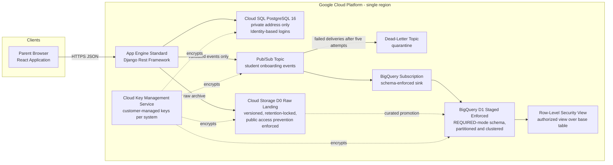

# HabotConnect Hiring Project 1.0 — Secure Staging Deployment & Automation Blueprint

**Candidate : Vivek R**
**Contact : vivekravi9496497657@gmail.com | +91 8590609366**
**Position applied for : Junior Cloud & DevOps Engineer (Google Cloud Platform / Django / React)**

---

## 1. Project Overview

This repository is the complete submission for the three tasks in the HabotConnect hiring
project document (Habot 1.0, dated 28 July 2026). The scenario: a junior developer pushed an
update that bypassed security guidelines — unencrypted application programming interface
credentials in raw code, plus a database schema mismatch that broke downstream analytics.
This blueprint restores system integrity with three mutually reinforcing mechanisms:

| Task | Deliverable | Where |
| --- | --- | --- |
| Task 1 — Terraform Secure Staging Provisioning | Modular infrastructure-as-code provisioning the D0 Raw Landing bucket, the D1 Staged/Enforced BigQuery dataset, strict conditional Identity and Access Management, Row-Level Security, Customer-Managed Encryption Keys, Pub/Sub streaming pipeline with dead-letter quarantine, App Engine application shell, and a private Cloud SQL PostgreSQL database | `terraform/` |
| Task 2 — Poka-Yoke Automated CI/CD Build Gate | Fail-closed GitHub Actions pipeline: ten sequential gates that immediately fail, halt, and quarantine the build on formatting errors or raw hardcoded secrets | `.github/workflows/ci.yml`, `security/gitleaks.toml` |
| Task 3 — Schema Mapping and DCYN Validation | Django Rest Framework serializer with exact field limits, the standalone binary Decision Yes/No library, and the mapping spreadsheets | `backend/onboarding/`, `data/*.xlsx` |

Every file in this repository carries the candidate name and contact at the top, per
submission instruction 3d. Every spreadsheet cell has Wrap Text enabled, per instruction 3c,
verified programmatically by `data/scripts/generate_workbooks.py`.

## 2. Architecture At A Glance



The ASCII rendering, the security diagram, and the pipeline diagram live in
[`docs/data_flow.md`](docs/data_flow.md); component rationale lives in
[`docs/architecture.md`](docs/architecture.md).

Key property: **only payloads that pass all twelve Decision Yes/No rules can enter the
streaming pipeline**, and **the BigQuery sink itself re-enforces the schema**, so the
scenario's schema-mismatch incident cannot recur silently — mismatched messages are retried
with backoff and then quarantined in the dead-letter topic instead of corrupting analytics.

## 3. Assumptions

The hiring document specifies the deliverables precisely but deliberately leaves several
parameters open ("translate vague specifications into secure architectures"). Every such gap
is documented as a numbered assumption with its rationale and its replacement procedure in
[`docs/assumptions.md`](docs/assumptions.md). The load-bearing ones:

- **A-01..A-03**: project identifier, region (`asia-south1` default), and naming are
  deployment parameters, never hardcoded.
- **A-05..A-06**: the onboarding payload fields and their exact limits are *not* specified in
  the document; they are defined here from the platform context (parents, children with
  learning difficulties, Learning Support Assistant matching) and centralized in
  `backend/onboarding/constants.py` so they can be changed in exactly one place.
- **A-09**: Row-Level Security policy specifics are not provided; an authorized-view pattern
  driven by a principal clearance allowlist is implemented declaratively, with the native
  `CREATE ROW ACCESS POLICY` equivalent recorded for migration.
- **DCYN**: the document defines it as a "binary Yes/No logic library"; this submission
  implements twelve stable rule identifiers whose outcomes are always exactly `YES` or `NO`.

Nothing in this repository pretends to originate from the PDF that is actually assumption;
the traceability matrix separates them explicitly.

## 4. Setup Instructions

Prerequisites: Terraform 1.5 or newer, Python 3.12 or newer, Git, and (for deployment only)
the Google Cloud command line interface.

### 4.1 Python service

```bash
cd backend
python -m venv .venv && source .venv/bin/activate      # Windows: .venv\Scripts\activate
python -m pip install -r requirements.txt
python manage.py migrate                                # local SQLite store is created automatically
python manage.py runserver                              # endpoint: http://127.0.0.1:8000/api/v1/onboarding/submissions/
```

No secret is needed locally: development mode reads no credentials, and the event publisher
defaults to a null implementation that records locally.

### 4.2 Terraform staging environment

```bash
cd terraform
terraform init -backend=false       # module and provider resolution; state stays local
terraform validate
terraform plan -var project_id=habot-demo-stg-001 -var project_number=123456789012
terraform apply ...                  # after review; see docs/decisions.md ADR-002 for state bootstrap
```

(The plan values above are format examples only; substitute the real staging project
identifier and its twelve-digit number.)

Remote state bootstrap (one-time, organization administrator): create a versioned,
public-access-prevention bucket named per convention and configure the backend block as
documented in `terraform/README.md`.

## 5. Validation Instructions (Poka-Yoke gates)

Run every gate locally exactly as continuous integration runs it:

```bash
# Gate: formatting
black --check --diff backend/ data/

# Gate: linting
ruff check backend/ data/

# Gates: Terraform canonical form and schema validity
cd terraform && terraform fmt -check -recursive && terraform validate && cd ..

# Gate: secret scanning (install once: https://github.com/gitleaks/gitleaks/releases)
gitleaks detect --source . --config security/gitleaks.toml --redact --exit-code 1

# Gate: vulnerability and misconfiguration scan (Trivy)
trivy fs . --scanners vuln,misconfig,secret --ignore-unfixed --skip-dirs demo/violations --exit-code 1

# Gates: deterministic validation tests and deployment readiness
cd backend && python -m pytest onboarding/tests && \
  DJANGO_SETTINGS_MODULE=config.settings DJANGO_DEBUG=False \
  DJANGO_SECRET_KEY=poka-yoke-ephemeral-0123456789-abcdefghijklmnopqrstuvwxyz \
  python manage.py check --deploy --fail-level WARNING && cd ..
```

Expected outcome: every command exits zero on the main branch. The workbook generator also
self-verifies the Wrap Text rule:

```bash
python data/scripts/generate_workbooks.py     # regenerates and asserts both spreadsheets
```

## 6. Testing Instructions

```bash
cd backend
python -m pytest onboarding/tests -v
```

Eighty-six deterministic tests cover: valid payload acceptance; each required field missing;
wrong types including coercion attempts; boundary arithmetic for name lengths, phone digit
counts, summary lengths, and child age (exactly two years accepted, one day short rejected,
exactly eighteen accepted, nineteen rejected); boolean Decision Yes/No consent gates against
false, null, string, and number inputs; unknown-field envelope strictness; endpoint behavior
including persistence of accepted submissions and zero persistence of rejected ones; and
decision-record determinism across repeated evaluations.

## 7. Security Approach

- **Fail closed everywhere**: any gate failure halts the pipeline; missing environment
  configuration prevents boot; unset optional bindings disable grants rather than widen them.
- **Least privilege with conditions**: runtime identity may create objects only under
  `incoming/`; the loader may read only under `raw/`; the analytics viewer may read only
  through the Row-Level Security view. All grants are reviewed in one file
  (`terraform/modules/iam_bindings/main.tf`).
- **Encryption**: customer-managed keys rotate every ninety days for Cloud Storage, BigQuery,
  and Pub/Sub; Cloud SQL uses Google-managed encryption at rest with its customer-managed
  upgrade path recorded in decisions.
- **No secrets in source**: secret scanning runs over full Git history; the only allowlisted
  paths are the quarantined training fixtures, and the pipeline's drill job re-proves
  detection outside that allowlist on every run.
- **Data protection**: parent email is excluded from the analytics view projection; raw
  landing objects are retention-locked and versioned; dead-letter messages are quarantined,
  never dropped.

Full analysis: [`security/threat_model.md`](security/threat_model.md),
[`security/security_assumptions.md`](security/security_assumptions.md).

## 8. Folder Structure

```text
habot-devops-project/
├── README.md                        ← this document
├── .github/workflows/ci.yml         ← Task 2: fail-closed build gate
├── .pre-commit-config.yaml          ← shift-left mirror of the same gates
├── terraform/                       ← Task 1: modular secure provisioning
│   ├── main.tf providers.tf versions.tf variables.tf outputs.tf
│   └── modules/
│       ├── project_services/        ← API enablement
│       ├── kms_encryption/          ← customer-managed keys + agent grants
│       ├── storage_raw_landing/     ← D0 Raw Landing bucket
│       ├── bigquery_staged/         ← D1 dataset + RLS view + clearance table
│       ├── pubsub_pipeline/         ← events topic, dead-letter quarantine, sink
│       ├── cloud_sql_staging/       ← private PostgreSQL, IAM logins, VPC connector
│       ├── app_engine_staging/      ← regional application shell + runtime identity
│       └── iam_bindings/            ← every grant, conditionally scoped
├── backend/                         ← Task 3: Django Rest Framework service
│   ├── manage.py requirements.txt requirements-staging.txt app.yaml pytest.ini conftest.py
│   ├── config/                      ← settings, URLs, WSGI, test settings shim
│   └── onboarding/
│       ├── constants.py             ← single source of truth for every limit
│       ├── dcyn.py                  ← the Decision Yes/No binary logic library
│       ├── serializers.py           ← exact-limit DRF serializer
│       ├── models.py publishers.py views.py urls.py apps.py
│       ├── migrations/
│       └── tests/                   ← eighty-six deterministic tests
├── data/
│   ├── schema_mapping.xlsx          ← Wrap Text verified, full forms only
│   ├── dcyn_logic_matrix.xlsx       ← decision matrix + validation matrix
│   ├── sample_payloads/             ← six labeled accept/reject demo payloads
│   └── scripts/generate_workbooks.py← reproducible spreadsheet builder
├── security/
│   ├── gitleaks.toml                ← secret policy + quarantined fixture scope
│   ├── threat_model.md
│   └── security_assumptions.md
├── demo/violations/                 ← quarantined Poka-Yoke drill fixtures
├── docs/
│   ├── architecture.md  data_flow.md  decisions.md  assumptions.md
│   ├── traceability_matrix.md  demo_guide.md  interview_prep.md
│   └── diagrams/
└── presentation/
    ├── slides.md                    ← twelve-slide interview deck content
    └── speaker_notes.md             ← narration and demonstration flow
```

## 9. Demonstration Entry Points

- Reproducing the fail-closed build gate (valid commit, malformed commit, leaked secret):
  [`docs/demo_guide.md`](docs/demo_guide.md)
- Slide-by-slide presentation package: [`presentation/slides.md`](presentation/slides.md)
- Requirement-to-evidence mapping:
  [`docs/traceability_matrix.md`](docs/traceability_matrix.md)

---

*Submission deadline stated in the hiring document: 25 August 2026.*
