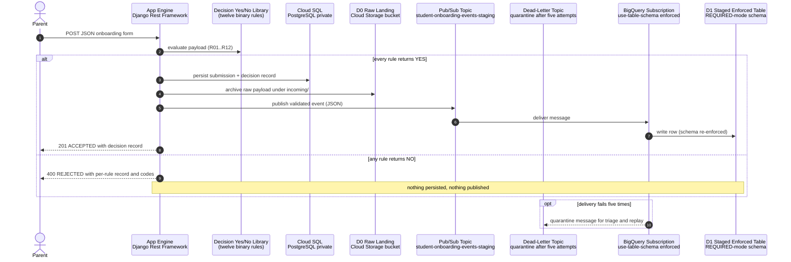
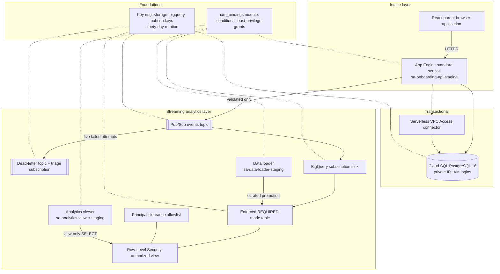
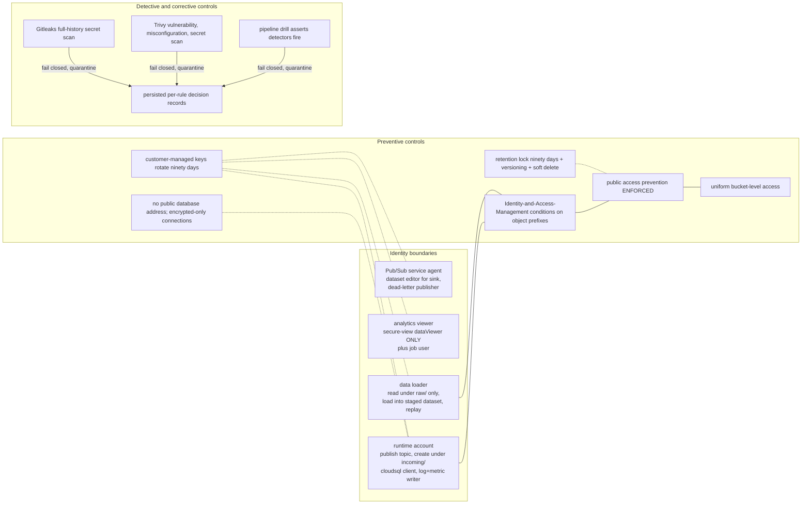
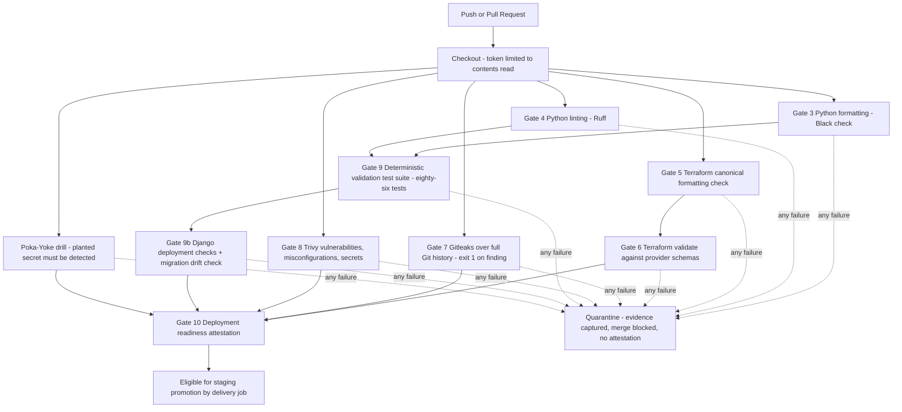

# Data Flow, Logical, Security, and Pipeline Diagrams

**Candidate : Vivek R — vivekravi9496497657@gmail.com | +91 8590609366**

All four diagrams describe one system. Names match Terraform resources and backend modules
exactly.

## 1. Data Flow Diagram

### Mermaid



### ASCII

```text
                 VALID PATH (every rule = YES)
 ┌────────┐   JSON    ┌─────────────┐  evaluate  ┌──────────────────┐
 │ Parent │──────────▶│  Django DRF │───────────▶│ Decision Yes/No  │
 └────────┘           │  on App     │            │ R01..R12 → YES   │
                      │  Engine     │◀───────────│                  │
                      └──┬───┬───┬──┘   verdict  └──────────────────┘
              persist    │   │   │ archive        publish
                         ▼   │   ▼                    ▼
               ┌──────────┐  │ ┌──────────────┐  ┌────────────────────┐
               │Cloud SQL │  │ │ D0 Raw       │  │ Pub/Sub events     │
               │Postgres  │  │ │ Landing      │  │ topic (CMEK)       │
               │private   │  │ │ incoming/,   │  └─────────┬──────────┘
               └──────────┘  │ │ retention    │            │ deliver
                             ▼ ▼ lock         ▼            ▼
                     schema-enforced sink  ┌────────────────────┐
                     BigQuery subscription▶│ D1 Staged Enforced │
                                           │ REQUIRED table     │
                                           └────────────────────┘

                 REJECT PATH (any rule = NO)
                      response 400 REJECTED + per-rule record
                      (nothing persisted, nothing published)

                 QUARANTINE PATH (delivery failure x5)
                      Pub/Sub events topic ──▶ dead-letter topic ──▶ triage pull
```

## 2. Logical Architecture Diagram

### Mermaid



### ASCII

```text
 React browser ──HTTPS──▶ App Engine (Django REST Framework)
                              │                │
                     private SQL path     validated events only
                              ▼                ▼
                        Cloud SQL ◀──connector── Pub/Sub topic ──▶ BigQuery sink
                        PostgreSQL                          │           │
                        (IAM logins)                   failures ×5        ▼
                                                            Dead-letter  D1 Staged Enforced
                                                              quarantine table (partitioned)
                                                                             │
                                             clearance allowlist ────────────┤
                                                                             ▼
                                              Row-Level Security view ◀── analytics viewer
                                                                            (view-only reader)

 Foundations: customer-managed keys encrypt GCS / BigQuery / Pub/Sub;
              iam_bindings scopes every identity to its narrowest surface.
```

## 3. Security Diagram

### Mermaid



### ASCII

```text
 WHO                                    WHAT THEY MAY DO                       ENFORCED BY
 runtime account        publish to events topic; create objects under     resource-level binding
                        incoming/ ONLY; reach private SQL; write logs     + object-prefix condition
 data loader            read objects under raw/ ONLY; load into staged    condition + dataset scope
                        dataset; replay curated events onto the topic
 analytics viewer       SELECT through secure view ONLY (parent email     view-level binding alone
                        excluded from projection); run own jobs
 Pub/Sub agent          write sink rows into staged dataset; forward      dataset binding +
                        failed deliveries to dead-letter topic            dead-letter publisher

 STANDING CONTROLS: public-access-prevention ENFORCED, uniform bucket access,
                    retention lock + versioning + soft delete,
                    customer-managed keys rotating every ninety days,
                    private-address-only database with encrypted-only sessions.

 DETECTIVE LAYER: full-history secret scan, dependency and misconfiguration scan,
                  persisted decision records, detector-health drill on every run.
                  Any red result quarantines the build before promotion.
```

## 4. CI/CD Pipeline Diagram

### Mermaid



### ASCII

```text
 checkout (contents: read token)
   ├── Gate 3 Black format check ─────────────┐
   ├── Gate 4 Ruff lint ──────────────┐       │
   ├── Gate 5 terraform fmt -check ──┐│       │
   │             └─▶ Gate 6 validate ┘│       ├─▶ Gate 9 tests ─▶ Gate 9b deploy checks ─┐
   ├── Gate 7 gitleaks (full history)│       │                                          │
   ├── Gate 8 trivy fs scanners ─────┴───────┴───────────────▶ Gate 10 ATTESTATION ◀──┘
   └── drill: planted secret MUST trip detector ──────────────▶        │
                                                                promotion eligibility
 ANY RED ANYWHERE ──▶ FAIL CLOSED ──▶ QUARANTINE (evidence kept, attestation never runs,
                                            branch protection keeps merge impossible)
```

## 5. Consistency Notes

- Component names in every diagram equal Terraform resource names (`d0-raw-landing`,
  `d1_staged_enforced_staging`, `student-onboarding-events-staging`) and the backend topic
  constant `ONBOARDING_EVENTS_TOPIC`.
- The pipeline diagram matches job order and `needs:` edges in `.github/workflows/ci.yml`
  exactly; the attestation job lists all nine upstream jobs in its `needs`.
- The security diagram's grant list mirrors `terraform/modules/iam_bindings/main.tf` line for
  line.
